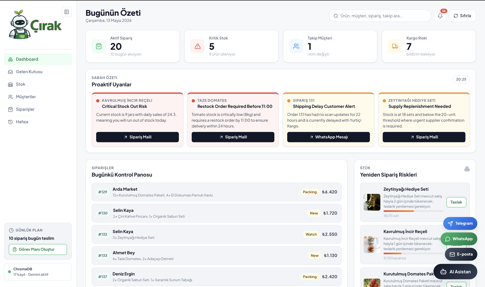
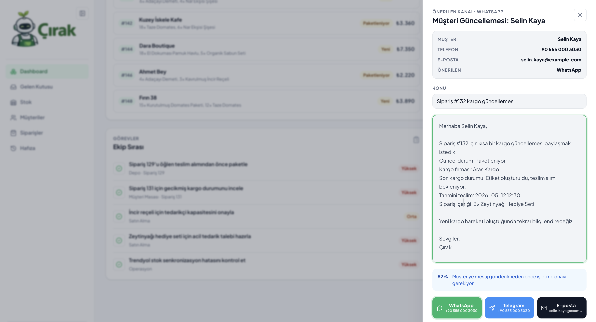
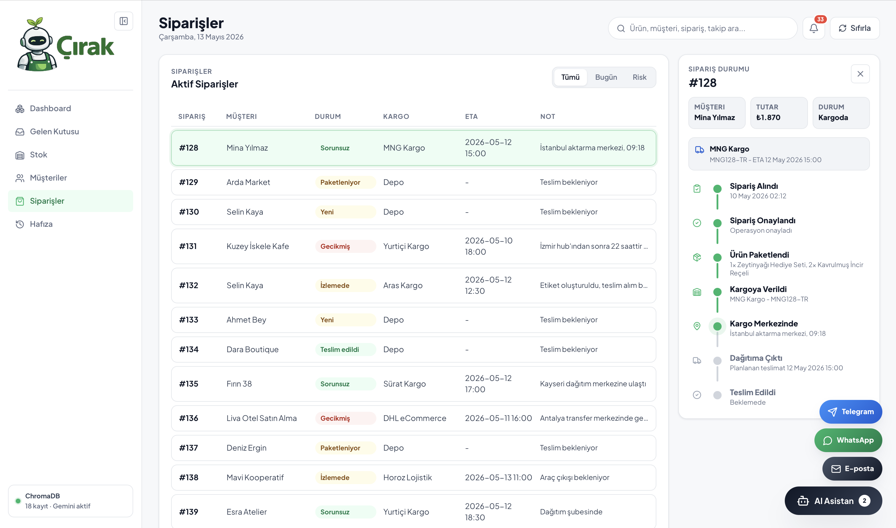

<div align="center">
  

  <h1>Çırak AI Ops</h1>

  <p><strong>An AI operations cockpit for small e-commerce teams, SMEs, and cooperatives.</strong></p>

  <p>
    
    
    
    
    
  </p>
</div>



## Overview

Çırak AI Ops is a working hackathon prototype for AI-supported operations. It brings the daily workflow of a small online seller into one place: orders, stock, customer messages, business memory, proactive alerts, and reviewable AI-generated drafts.

The target user is a business with roughly 20-200 products and 10-100 daily orders. Çırak remembers customer habits, supplier behavior, shipment patterns, and recurring stock risks, then turns that memory into morning insights and concrete next actions.

The app runs as a React frontend with a FastAPI backend. Gemini and live email/commerce connectors are optional; without credentials, the demo still works with deterministic fallbacks and in-memory demo data.

## What It Does

| Area | Capability |
| --- | --- |
| Operations dashboard | Turkish cockpit for metrics, stock risk, shipment pressure, due orders, tasks, and proactive insight cards. |
| Business memory | ChromaDB-backed memory records, manual note ingestion, seed data, retrieval status, and RAG-ready context. |
| AI insights | Gemini-generated morning cards when configured, with reliable fallback cards for offline demos. |
| Inbox assistant | IMAP sync or demo messages, intent classification, entity linking, customer reply drafts, and human approval before send. |
| Global search | Fast navigation across products, customers, orders, inbox threads, chat history, memory records, and alerts. |
| Floating assistant | Order lookup, stock checks, customer reply generation, and local Telegram, WhatsApp, and email draft composers. |
| Draft review | Editable supplier restock, shipment update, and customer-response drafts with confidence indicators. |
| Connector health | IMAP, SMTP, and generic commerce adapter status for demo-readiness checks. |

## Demo Flow

Use this path for a focused 3-minute walkthrough:

1. Open the dashboard and show proactive Turkish alerts, live metrics, stock risks, due orders, and the notification tray.
2. Use global search to jump from a product, customer, order, inbox thread, chat item, or memory record into the right page.
3. Open the Memory page, check ChromaDB record count and Gemini/fallback status, then save a note in `Teach the assistant`.
4. Trigger an insight action or stock action to open a reviewable supplier/customer draft.
5. Open `Gelen Kutusu`, sync mail, review the generated reply draft, edit it, then approve it.
6. Ask the floating assistant: `When will order 128 arrive?`, then try the Telegram, WhatsApp, and email mock composers.

## Screenshots

| Assistant and messages | Order tracking |
| --- | --- |
|  |  |

## AI Design

Çırak uses three layers:

1. **Memory and RAG**: business events are stored in ChromaDB, retrieved by relevance, and passed into Gemini for insight generation when an API key is available.
2. **Operational tools**: deterministic tools keep core actions predictable during demos, including order lookup, stock checks, restock suggestions, shipment-risk detection, and task generation.
3. **Inbox pipeline**: inbound emails are classified, linked to orders/products/customers, enriched with memory, and converted into reviewable drafts.

When `GEMINI_API_KEY` or `GOOGLE_API_KEY` is set, `/api/insights/morning` asks Gemini for structured insight cards and memory search uses Gemini embeddings. Without a key, the same flows stay available through fallback insights and local hash embeddings.

Default AI settings:

| Setting | Default |
| --- | --- |
| `GEMINI_MODEL` | `gemini-2.5-flash` |
| `GEMINI_EMBEDDING_MODEL` | `gemini-embedding-001` |
| `CHROMA_DB_PATH` | `./chroma_store` |
| `CHROMA_COLLECTION_NAME` | `business_memory` |

## Architecture

| Path | Purpose |
| --- | --- |
| `src/App.tsx` | Frontend shell composition and page routing state. |
| `src/app/` | Controller hook, navigation, search, notifications, drafts, formatting, and UI-specific types. |
| `src/components/` | Sidebar, topbar, search menu, notification panel, draft drawer, assistant, and shared UI primitives. |
| `src/pages/` | Dashboard, inbox, stock, customers, orders, and memory views. |
| `src/api.ts` | Frontend client for the FastAPI `/api/*` endpoints. |
| `backend/app/main.py` | FastAPI routes for state, chat, tasks, drafts, inbox, connectors, memory, and insights. |
| `backend/app/agent.py` | Operational assistant runtime and tool-backed response generation. |
| `backend/app/inbox.py` | IMAP ingestion, email threading, draft creation, approval, and SMTP send or dry-run recording. |
| `backend/app/commerce.py` | Provider-neutral commerce connector with demo and generic REST adapters. |
| `backend/app/memory.py` | ChromaDB memory store, Gemini embeddings, local fallbacks, seeding, and retrieval. |
| `backend/app/insights.py` | RAG prompt construction, Gemini/fallback insight generation, and insight actions. |
| `backend/app/store.py` | In-memory demo state for products, orders, customers, shipments, alerts, and tasks. |

Actions mutate the FastAPI in-memory state so the dashboard visibly changes during a demo. `Reset demo` restores operational data and reseeds memory.

## API Surface

| Endpoint | Use |
| --- | --- |
| `GET /api/health` | Backend health check. |
| `GET /api/state` | Current operations state. |
| `POST /api/chat` | Floating assistant response and optional contact draft. |
| `POST /api/tasks/generate` | Generate daily task plan. |
| `POST /api/tasks/{task_id}/complete` | Mark a task complete. |
| `POST /api/shipments/{order_id}/notify` | Mark a shipment notification as sent. |
| `POST /api/inventory/{product_id}/draft` | Create a supplier restock draft. |
| `POST /api/reset` | Reset operational state, inbox state, and seeded memory. |
| `GET /api/memory/status` | ChromaDB/fallback status and record count. |
| `GET /api/memory/records` | Stored business memory records. |
| `POST /api/memory/seed` | Reset demo memory records. |
| `POST /api/memory/ingest` | Add new memory records. |
| `POST /api/insights/morning` | Generate proactive insight cards. |
| `POST /api/inbox/sync` | Sync IMAP or load demo inbox messages. |
| `GET /api/inbox/threads` | List customer email threads. |
| `GET /api/inbox/threads/{id}` | Read a single thread. |
| `POST /api/assistant/drafts/{id}/approve` | Approve and send or dry-run an assistant draft. |
| `GET /api/connectors/health` | IMAP, SMTP, and commerce connector status. |

FastAPI docs are available at `http://127.0.0.1:8000/docs` while the backend is running.

## Run Locally

### Prerequisites

- Python 3.11+
- Node.js 20+
- npm

### 1. Install dependencies

```bash
python3 -m pip install -r requirements.txt
npm install
```

### 2. Start the backend

```bash
npm run dev:backend
```

The API runs on `http://127.0.0.1:8000`.

### 3. Start the frontend

In a second terminal:

```bash
npm run dev:frontend
```

Open `http://localhost:5173/`. Vite proxies `/api` to FastAPI on `http://127.0.0.1:8000`.

### 4. Build for production

```bash
npm run build
```

## Optional Configuration

The app works without these variables. Add them when you want live AI, email, or commerce integrations.

### Gemini and memory

```bash
export GEMINI_API_KEY="your-key"
# or: export GOOGLE_API_KEY="your-key"
export GEMINI_MODEL="gemini-2.5-flash"
export GEMINI_EMBEDDING_MODEL="gemini-embedding-001"
export CHROMA_DB_PATH="./chroma_store"
```

### Email inbox and sending

```bash
export IMAP_HOST="imap.example.com"
export IMAP_USERNAME="support@example.com"
export IMAP_PASSWORD="..."
export SMTP_HOST="smtp.example.com"
export SMTP_FROM_EMAIL="support@example.com"
```

Useful optional email settings:

| Variable | Default |
| --- | --- |
| `IMAP_PORT` | `993` |
| `IMAP_MAILBOX` | `INBOX` |
| `IMAP_USE_SSL` | `true` |
| `EMAIL_SYNC_LIMIT` | `25` |
| `SMTP_PORT` | `587` |
| `SMTP_USERNAME` | unset |
| `SMTP_PASSWORD` | unset |
| `SMTP_USE_TLS` | `true` |

### Commerce adapter

```bash
export COMMERCE_API_BASE_URL="https://commerce.example.com"
export COMMERCE_API_TOKEN="..."
```

Without `COMMERCE_API_BASE_URL`, the backend uses the in-memory demo commerce adapter.

## Notes

- Telegram and WhatsApp buttons are local mock composers. They do not redirect to external apps or require bot credentials.
- Email drafts always require human approval before SMTP is called.
- If SMTP is not configured, draft approval records a dry-run send action.
- The prototype is optimized for hackathon storytelling, demo resetability, and readable integration points.
